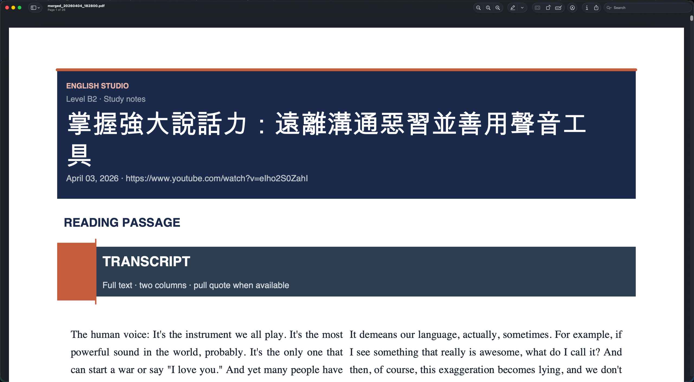
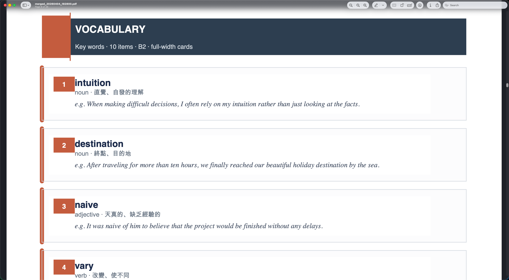

+++
date = '2026-04-04T18:24:20+08:00'
draft = false
title = '這份 Skill 讓你把影片轉換成可以學習的材料！'
tags = ["LLM", "SKILL"]
categories = ["LLM"]
+++

因應之後要通勤上下班，所以開始找了一些英文的學習材料來聽，但發現一個很重要的問題，你聽不懂的還是聽不懂，即便聽再多遍也一樣。
為了解決這個問題，我跟 AI 討論了一下，他給我了我一個方向：

> 聽力的重點在質不在量，找到一篇文章後可以先自己精讀過，再開始聽。至於聽的方法，則是先大概跟著影片走過一遍感受節奏，之後再開始進行 Shadowing 才會有比較好的效果。

因此，這份 Skill 就這樣出來了。


flowchart LR
    A[🎬 YouTube Video] --> B[/transcribe/]
    B --> C[📝 Transcript]
    C --> D[/analyze/]
    D --> E[📊 Analysis]
    E --> F[/generate/]
    F --> G[📄 PDF]


整套流程的思路如下，使用 claude code session 傳入你想閱讀的 youtube video link (目前只支援英文->繁體中文的選項)
然後先針對該 Youtube Video 取出逐字稿，然後針對你的需求的難度去進行分析，拆解生字與常見句型，最後則是把結果產出變成一份 PDF。

接著來詳細說明一下，每一步裡面在做的事情是什麼。

### `/transcribe {youtube link}`

預設使用 python framework 來作為取得逐字稿的工具，基本上大部分的影片都可以取得，不過也有可能是因為我都是選擇 TED Talks 相關的影片來看，如果失敗的話，則會走回 Fallback 流程，改成使用 OpenAI Whisper 來做語音的辨識，進而產生逐字稿，這段會需要額外手動設定 OpenAI API KEY。

產生完的結果，會在 Pages 內建立一個該影片主題的資料夾，裡面會有一份 transcribe.md

### `/analyze {transcribe.md}`

支援參數:
--level [B1|B2|C1] default: B2
--memory [path to memory file] default: .claude/memory.md under current working direction

這步的話則是使用 gemini-2.5-flash 開始進行分析，所以必須要確保電腦上有安裝 gemini-cli 並且已經完成登入。
至於為什麼會使用 gemini 原因很簡單，因為這步其實就是從一篇文章中去挑選出生字與句型，任務難度極低，但是因為影片長度不一定，所以必須要盡可能地挑選較大的 Context Window 避免會有爆掉的可能，所以 gemini 就是現行的最佳選擇。

至於參數的部分：
level: 可以讓你先設定自己的難度，然後從文章中挑選出符合這個難度的單字來給你。
memory: 讓 LLM 本身具備記憶功能，避免有些單字或是句型重複被挑選到，預設會在當前目錄的 `.claude/memory.md` 當中，會由 analyze.py 自動寫入與維護，最後的結果也會在該影片的資料夾中，新增一份 analyze.md 的檔案。

### `/generate {analyze.md}`

這步就相對簡單了，他會透過抓取指定的 analyze.md 與 transcribe.md (預設會跟 analyze.md 在同個路徑底下)，抓到之後會透過 python 把這些內容產出變成固定格式的 pdf ，最後把這份 pdf 放在資料夾當中

---

同場加映兩個指令

### `/learn {youtube link}`

三個步驟分開執行太累了，我設計了一個指令，只要傳入 youtube link 之後，則會把三個步驟接連執行完成。

### `/merge`

支援參數:
--clean [是否清除 Pages 資料夾？] 帶了才會清，預設是不清除

因為目前產出的路徑都會在 Pages 當中，因為我自己會把 pdf 印出來，用紙筆還是有點溫度的XD，所以這個指令在做的事情很簡單，就是把 Pages 內不管有幾個資料夾，都會把裡面的 pdf 去進行合併，我設計的那個 clean 參數只是因為一定我有最終結果了，中間的產物其實不是我需要的，所以我多半會搭配著 `--clean` 去把內容清除。

然後讓我們來看一下效果吧！

---

基本上到這邊就是全部的內容了，Skill 的內容完全透明，也沒有做什麼奇奇怪怪的事情，動機就是想把英文學好XD
然後也趁著這次機會搞懂一下 Skill 的概念、原理，以及該如何進行發佈。
使用上有問題隨時留言讓我知道，需要新增什麼功能可以許願，或是自己拿去改吧！

https://github.com/nick1ee/yt-to-pdf-skill